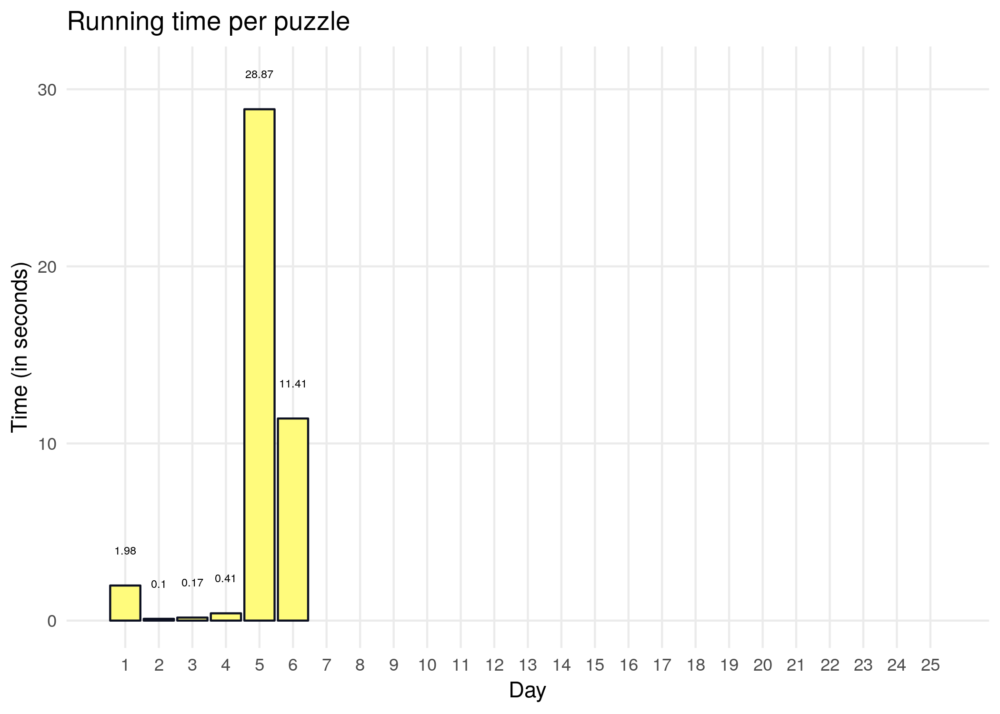

Advent of code 2018
===================

Solutions of [Advent of Code 2018](https://adventofcode.com/2018) with R using only base and tidyverse functions. Figure heavily borrowed from @abichat [repo](https://github.com/abichat/adventofcode2018)

 

